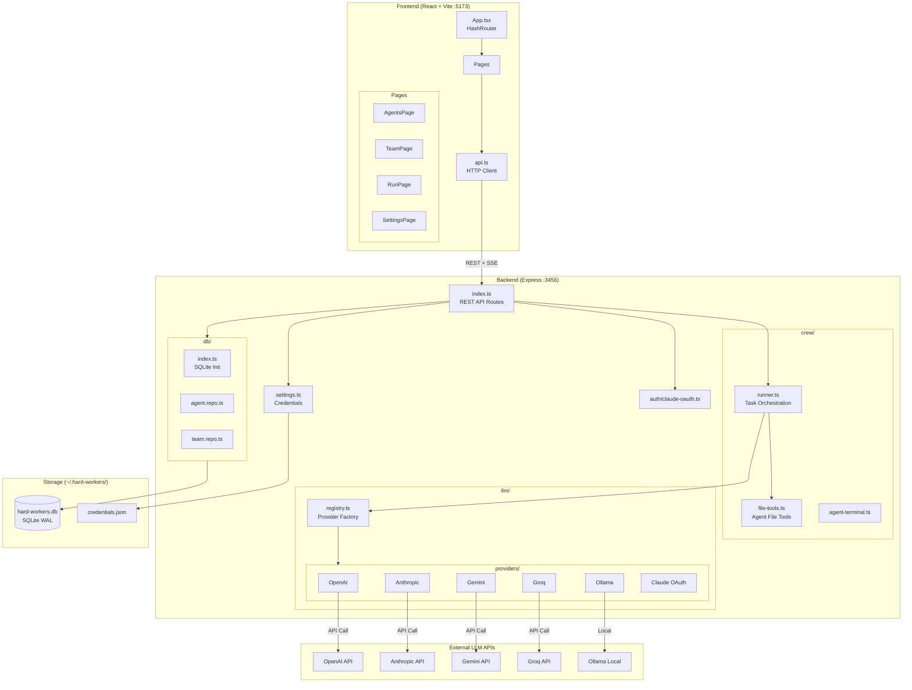
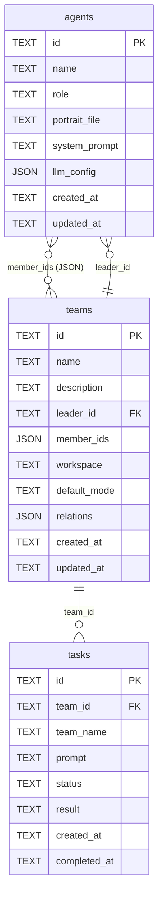
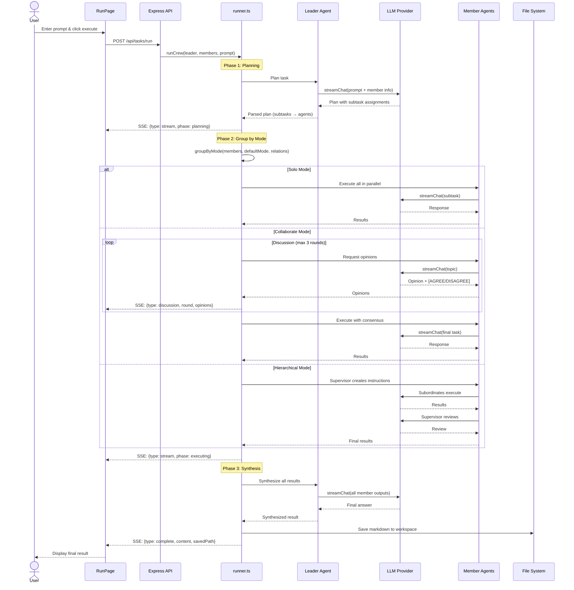
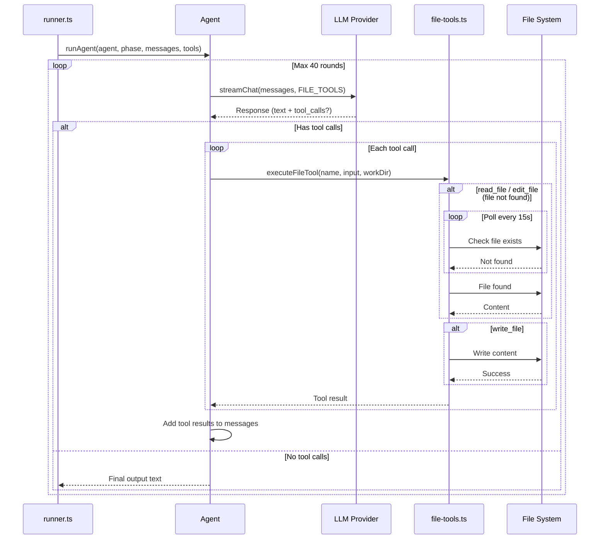
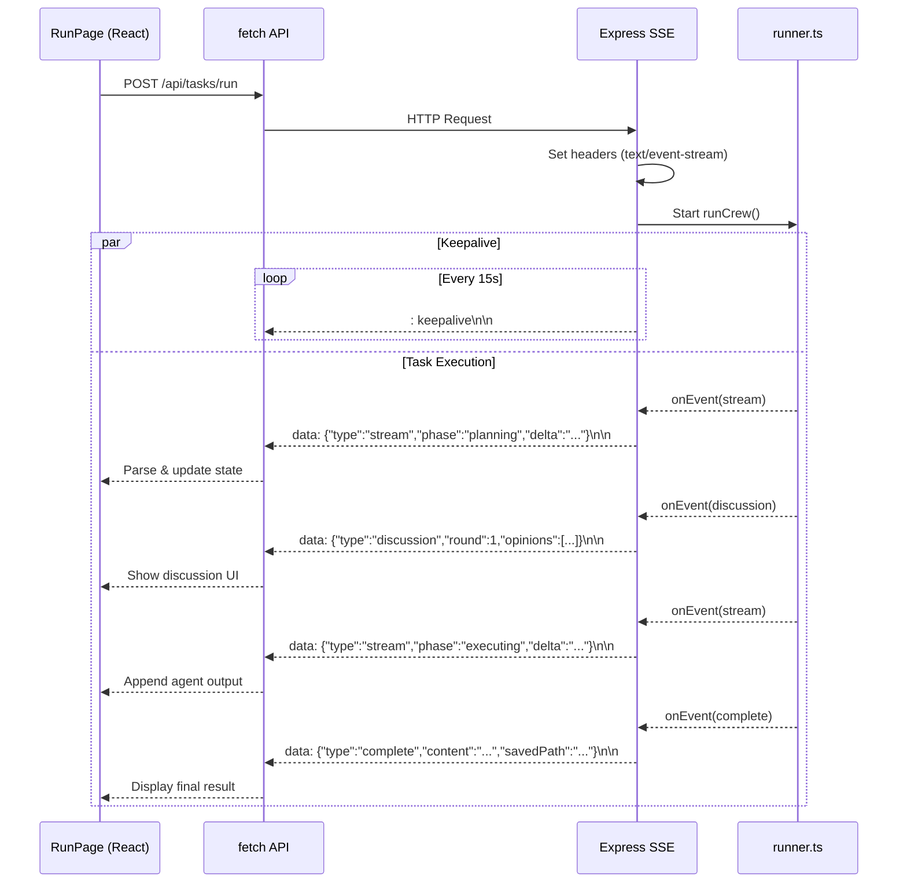
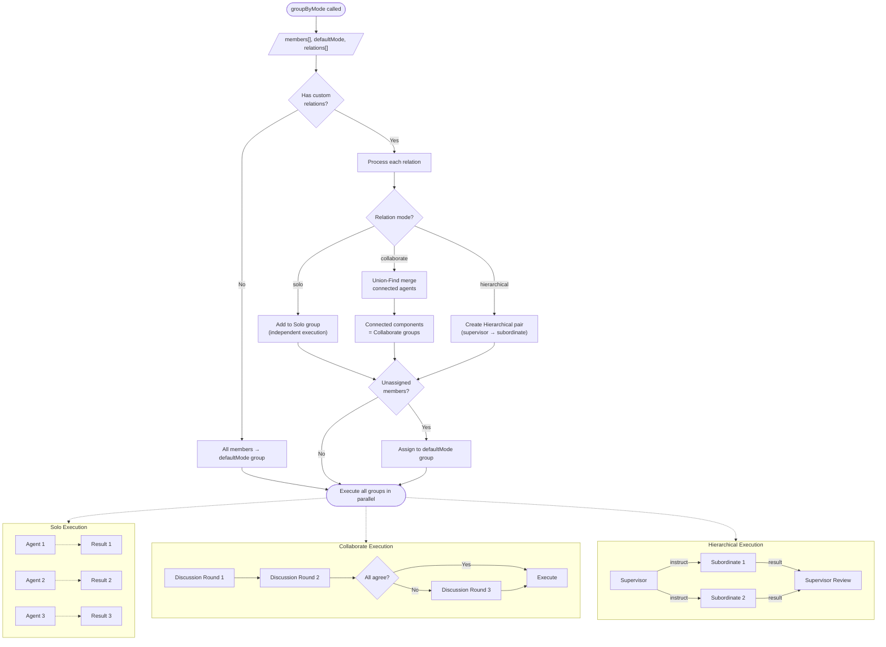
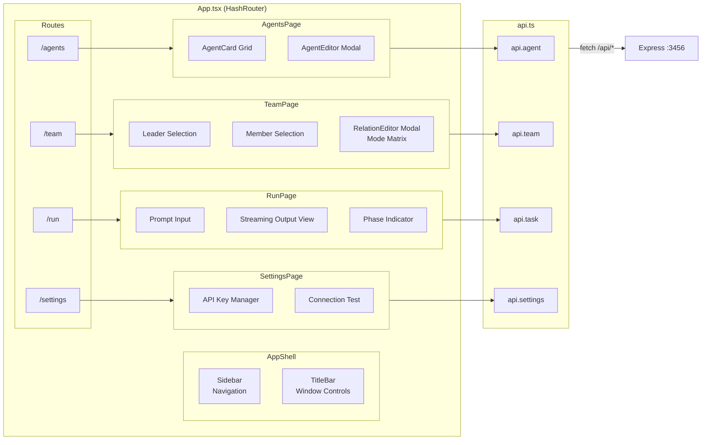

# Hard Workers - Architecture & Sequence Diagrams

## System Architecture

## Database Schema

## Task Execution Sequence

## Agent Tool-Use Loop

## SSE Streaming Flow

## Team Grouping Algorithm

## Frontend Route & Component Structure

